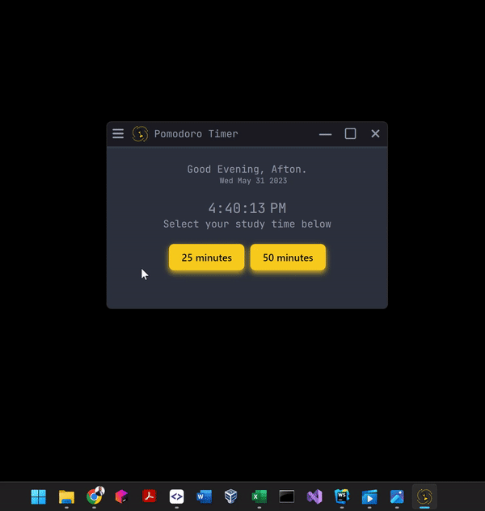

`PomodoroTimer` is a desktop app that monitors and tracks study time.



**Usage**
---

```
To use the pomodoro timer application, open the application and
click either study for 25 minutes or 50 minutes. A timer will be set for 
the selected time. At that point, you can pause the timer or stop it completely.
At the end of the study time, an alarm will go off prompting you to take a 
break for a specified amount of time depending on how long you have studied.
The timer will be set for the break when the user clicks start break.
```

**Installation Options**
---

Add some text to explain installation

**How to Contribute**
---

1. Clone repo and create a new branch: `$ git checkout https://github.com/AftonLawver/PomodoroTimer -b name_for_new_branch`.
2. Make changes and test
3. Submit Pull Request with comprehensive description of changes

**Features in Progress**
---

1. Making a button that can turn the app from dark mode to light mode.
2. Creating a first popup window that asks the user their name and email address, so that they can save their
data to their profile. 
3. Creating a database with different tables to hold all of the apps information.